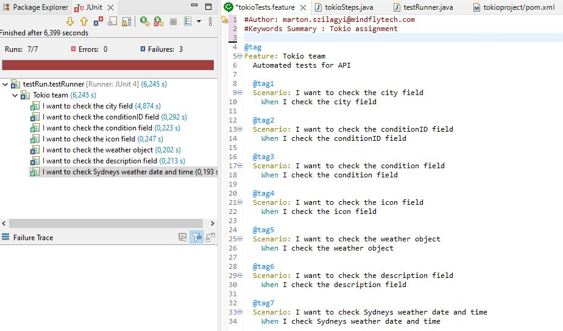

# Selenium QA Interview (Tokio team)


I started the tests from Eclips-IDE as an JUnit Test:



Short summary:
testrun name="testRunner" project="tokioproject" tests="7" started="7" failures="3" errors="0" ignored="0" \
testsuite name="testRun.testRunner" time="6.226" \
testsuite name="Tokio team" time="6.226" \
testcase name="I want to check the city field" classname="Tokio team" time="4.834" --> OK \
testcase name="I want to check the conditionID field" classname="Tokio team" time="0.282" --> The element is missing from JSON data structure. \
testcase name="I want to check the condition field" classname="Tokio team" time="0.204" --> OK \
testcase name="I want to check the icon field" classname="Tokio team" time="0.258" --> OK \
testcase name="I want to check the weather object" classname="Tokio team" time="0.2" --> Celsius was miscalculated \
testcase name="I want to check the description field" classname="Tokio team" time="0.216" --> Description is not accurate \
testcase name="I want to check Sydneys weather date and time" classname="Tokio team" time="0.232" --> I could not finish the selenium part, sorry

Full xml protocol from JUnit run:
```xml
<testrun name="testRunner" project="tokioproject" tests="7" started="7" failures="3" errors="0" ignored="0">
<testsuite name="testRun.testRunner" time="6.226">
<testsuite name="Tokio team" time="6.226">
<testcase name="I want to check the city field" classname="Tokio team" time="4.834"/>
<testcase name="I want to check the conditionID field" classname="Tokio team" time="0.282">
<failure>java.lang.AssertionError: The element is missing from JSON data structure. at org.junit.Assert.fail(Assert.java:89) at stepDefinition.tokioSteps.i_check_the_conditionid_field(tokioSteps.java:48) at ✽.I check the conditionID field(file:///C:/Users/szila/eclipse-workspace/tokioproject/src/main/java/featureFiles/tokioTests.feature:29) </failure>
</testcase>
<testcase name="I want to check the condition field" classname="Tokio team" time="0.204"/>
<testcase name="I want to check the icon field" classname="Tokio team" time="0.258"/>
<testcase name="I want to check the weather object" classname="Tokio team" time="0.2">
<failure>java.lang.AssertionError: Celsius was miscalculated at org.junit.Assert.fail(Assert.java:89) at stepDefinition.tokioSteps.i_check_the_weather_object(tokioSteps.java:68) at ✽.I check the weather object(file:///C:/Users/szila/eclipse-workspace/tokioproject/src/main/java/featureFiles/tokioTests.feature:41) </failure>
</testcase>
<testcase name="I want to check the description field" classname="Tokio team" time="0.216">
<failure>java.lang.AssertionError: Description is not accurate at org.junit.Assert.fail(Assert.java:89) at stepDefinition.tokioSteps.i_check_the_description_field(tokioSteps.java:79) at ✽.I check the description field(file:///C:/Users/szila/eclipse-workspace/tokioproject/src/main/java/featureFiles/tokioTests.feature:45) </failure>
</testcase>
<testcase name="I want to check Sydneys weather date and time" classname="Tokio team" time="0.232"/>
</testsuite>
</testsuite>
</testrun>
```
